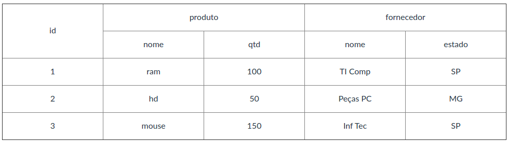

# HBase - Exercícios

```

docker-compose up -d

docker ps

docker exec -it hbase-master bash

hbase shell


# 1. Criar a tabela ‘controle’ com os dados:

	Chave: id
	Família de Coluna: produto e fornecedor


```




```

# Criando a tabela 'controle'
create 'controle', {NAME => 'produto'}, {NAME => 'fornecedor'}
=> Hbase::Table - controle 

# Inserindo produto:nome
put 'controle', '1', 'produto:nome', 'ram'
put 'controle', '2', 'produto:nome', 'hd'
put 'controle', '3', 'produto:nome', 'mouse'

# Listando
scan 'controle'

	ROW                       COLUMN+CELL                                                             
	 1                        column=produto:nome, timestamp=1620548152274, value=ram                 
	 2                        column=produto:nome, timestamp=1620548199911, value=hd                  
	 3                        column=produto:nome, timestamp=1620548220705, value=mouse               
	3 row(s) in 0.0400 seconds


# Inserindo produto:qtd
put 'controle', '1', 'produto:qtd', '100'
put 'controle', '2', 'produto:qtd', '50'
put 'controle', '3', 'produto:qtd', '150'


scan 'controle'

	ROW                       COLUMN+CELL                                                             
	 1                        column=produto:nome, timestamp=1620548152274, value=ram                 
	 1                        column=produto:qtd, timestamp=1620548404725, value=100                  
	 2                        column=produto:nome, timestamp=1620548199911, value=hd                  
	 2                        column=produto:qtd, timestamp=1620548409867, value=50                   
	 3                        column=produto:nome, timestamp=1620548220705, value=mouse               
	 3                        column=produto:qtd, timestamp=1620548415087, value=150                  
	3 row(s) in 0.0220 seconds
	
	
# Inserindo fornecedor:nome
put 'controle', '1', 'fornecedor:nome', 'TI Comp'
put 'controle', '2', 'fornecedor:nome', 'Peças PC'
put 'controle', '3', 'fornecedor:nome', 'Inf Tec'
	
	
scan 'controle'	

	ROW                       COLUMN+CELL                                                             
	 1                        column=fornecedor:nome, timestamp=1620548643134, value=TI Comp          
	 1                        column=produto:nome, timestamp=1620548152274, value=ram                 
	 1                        column=produto:qtd, timestamp=1620548404725, value=100                  
	 2                        column=fornecedor:nome, timestamp=1620548647689, value=Pe\xC3\xA7as PC  
	 2                        column=produto:nome, timestamp=1620548199911, value=hd                  
	 2                        column=produto:qtd, timestamp=1620548409867, value=50                   
	 3                        column=fornecedor:nome, timestamp=1620548654022, value=Inf Tec          
	 3                        column=produto:nome, timestamp=1620548220705, value=mouse               
	 3                        column=produto:qtd, timestamp=1620548415087, value=150                  
	3 row(s) in 0.0140 seconds


# Inserindo fornecedor:estado
put 'controle', '1', 'fornecedor:estado', 'SP'
put 'controle', '2', 'fornecedor:estado', 'MG'
put 'controle', '3', 'fornecedor:estado', 'SP'


scan 'controle'	

	ROW                       COLUMN+CELL                                                             
	 1                        column=fornecedor:estado, timestamp=1620548879275, value=SP             
	 1                        column=fornecedor:nome, timestamp=1620548643134, value=TI Comp          
	 1                        column=produto:nome, timestamp=1620548152274, value=ram                 
	 1                        column=produto:qtd, timestamp=1620548404725, value=100                  
	 2                        column=fornecedor:estado, timestamp=1620548884964, value=MG             
	 2                        column=fornecedor:nome, timestamp=1620548647689, value=Pe\xC3\xA7as PC  
	 2                        column=produto:nome, timestamp=1620548199911, value=hd                  
	 2                        column=produto:qtd, timestamp=1620548409867, value=50                   
	 3                        column=fornecedor:estado, timestamp=1620548890230, value=SP             
	 3                        column=fornecedor:nome, timestamp=1620548654022, value=Inf Tec          
	 3                        column=produto:nome, timestamp=1620548220705, value=mouse               
	 3                        column=produto:qtd, timestamp=1620548415087, value=150                  
	3 row(s) in 0.0430 seconds


# 2. Listar as tabelas e verificar a estrutura da tabela ‘controle’

# Listar as tabelas
list

TABLE                                                                                             
controle                                                                                          
1 row(s) in 0.0430 seconds


# Verificar a estrutura da tabela ‘controle’
describe 'controle'

Table controle is ENABLED          

controle                                                                                          

COLUMN FAMILIES DESCRIPTION                                                                       

{NAME => 'fornecedor', BLOOMFILTER => 'ROW', VERSIONS => '1', IN_MEMORY => 'false', KEEP_DELETED_CELLS => 'FALSE', 
DATA_BLOCK_ENCODING => 'NONE', TTL => 'FOREVER', COMPRESSION => 'NONE', MIN_VERSIONS => '0', 
BLOCKCACHE => 'true', BLOCKSIZE => '65536', REPLICATION_SCOPE => '0'}                 

{NAME => 'produto', BLOOMFILTER => 'ROW', VERSIONS => '1', IN_MEMORY => 'false', KEEP_DELETED_CELLS => 'FALSE', 
DATA_BLOCK_ENCODING => 'NONE', TTL => 'FOREVER', COMPRESSION => 'NONE', MIN_VERSIONS => '0', 
BLOCKCACHE => 'true', BLOCKSIZE => '65536', REPLICATION_SCOPE => '0'}                    

2 row(s) in 0.0950 seconds


# 3. Contar o número de registros da tabela ‘controle’

count 'controle'

	3 row(s) in 0.0170 seconds

	=> 3


# 4. Alterar  a família de coluna produto para 3 versões

# Padrão de VERSIONS é 1
# Schema família das colunas
alter 'controle', {NAME => 'produto', VERSIONS => 3}

	Updating all regions with the new schema...
	1/1 regions updated.
	Done.
	0 row(s) in 1.9720 seconds

describe 'controle'

	Table controle is ENABLED  
	
	controle                                                                                                                                                                         
	
	COLUMN FAMILIES DESCRIPTION                                                                                                                                                      
	
	{NAME => 'fornecedor', BLOOMFILTER => 'ROW', VERSIONS => '1', IN_MEMORY => 'false', KEEP_DELETED_CELLS => 'FALSE', 
	DATA_BLOCK_ENCODING => 'NONE', TTL => 'FOREVER', COMPRESSION => 'NONE', MIN_VERSIONS => '0', BLOCKCACHE => 'true', 
	BLOCKSIZE => '65536', REPLICATION_SCOPE => '0'}
	
	{NAME => 'produto', BLOOMFILTER => 'ROW', VERSIONS => '3', IN_MEMORY => 'false', KEEP_DELETED_CELLS => 'FALSE', 
	DATA_BLOCK_ENCODING => 'NONE', TTL => 'FOREVER', COMPRESSION => '
	NONE', MIN_VERSIONS => '0', BLOCKCACHE => 'true', BLOCKSIZE => '65536', REPLICATION_SCOPE => '0'}     
	
	2 row(s) in 0.1650 seconds	


# 5. Alterar a quantidade para 200 do id 2

put 'controle', '2', 'produto:qtd', '200'


# 6. Pesquisar as versões do id 2  da coluna quantidade

# Usar 'get' quando buscar pela chave ('scan' é em toda a tabela)
get 'controle', '2', {COLUMNS => 'produto:qtd', VERSIONS => 2}

	COLUMN                    CELL                                                                   
	 produto:qtd              timestamp=1620549867831, value=200                                     
	 produto:qtd              timestamp=1620548409867, value=50                                      
	2 row(s) in 0.0090 seconds


get 'controle', '2', {COLUMNS => 'produto', VERSIONS => 2}

	COLUMN                    CELL                                                                   
	 produto:nome             timestamp=1620548199911, value=hd                                      
	 produto:qtd              timestamp=1620549867831, value=200                                     
	 produto:qtd              timestamp=1620548409867, value=50                                      
	3 row(s) in 0.0230 seconds
	
	
get 'controle', '2', {COLUMNS => ['produto:qtd', 'fornecedor:nome'], VERSIONS => 2}	

	COLUMN                    CELL                                                                   
	 fornecedor:nome          timestamp=1620548647689, value=Pe\xC3\xA7as PC                         
	 produto:qtd              timestamp=1620549867831, value=200                                     
	 produto:qtd              timestamp=1620548409867, value=50                                      
	3 row(s) in 0.0090 seconds


get 'controle', '2', {COLUMNS => ['produto:qtd', 'fornecedor'], VERSIONS => 2}	

	COLUMN                    CELL                                                                   
	 fornecedor:estado        timestamp=1620548884964, value=MG                                      
	 fornecedor:nome          timestamp=1620548647689, value=Pe\xC3\xA7as PC                         
	 produto:qtd              timestamp=1620549867831, value=200                                     
	 produto:qtd              timestamp=1620548409867, value=50                                      
	4 row(s) in 0.0080 seconds


# Só vai mostrar dois registros, embora esteja com versions 3
# pois só ocorreu dois put
get 'controle', '2', {COLUMNS => ['produto:qtd'], VERSIONS => 3}	

	COLUMN                    CELL                                                                   
	 produto:qtd              timestamp=1620549867831, value=200                                     
	 produto:qtd              timestamp=1620548409867, value=50                                      
	2 row(s) in 0.0130 seconds


# Mostra somente último valor
get 'controle', '2'
	COLUMN                    CELL                                                                   
	 fornecedor:estado        timestamp=1620548884964, value=MG                                      
	 fornecedor:nome          timestamp=1620548647689, value=Pe\xC3\xA7as PC                         
	 produto:nome             timestamp=1620548199911, value=hd                                      
	 produto:qtd              timestamp=1620549867831, value=200                                     
	4 row(s) in 0.0440 seconds


# 7. Excluir os id do estado de SP

help get

	  hbase> t.get 'r1'
	  hbase> t.get 'r1', {TIMERANGE => [ts1, ts2]}
	  hbase> t.get 'r1', {COLUMN => 'c1'}
	  hbase> t.get 'r1', {COLUMN => ['c1', 'c2', 'c3']}
	  hbase> t.get 'r1', {COLUMN => 'c1', TIMESTAMP => ts1}
	  hbase> t.get 'r1', {COLUMN => 'c1', TIMERANGE => [ts1, ts2], VERSIONS => 4}
	  hbase> t.get 'r1', {COLUMN => 'c1', TIMESTAMP => ts1, VERSIONS => 4}
	  hbase> t.get 'r1', {FILTER => "ValueFilter(=, 'binary:abc')"}
	  hbase> t.get 'r1', 'c1'
	  hbase> t.get 'r1', 'c1', 'c2'
	  hbase> t.get 'r1', ['c1', 'c2']
	  hbase> t.get 'r1', {CONSISTENCY => 'TIMELINE'}
	  hbase> t.get 'r1', {CONSISTENCY => 'TIMELINE', REGION_REPLICA_ID => 1}


# HBase basicamente para armazenar, usando get e put
# e para filtrar, costuma-se usar outras aplicações (Java ou tabela para mapear)

scan 'controle', {COLUMNS => 'fornecedor:estado'}

	ROW                      COLUMN+CELL                                                          
	 1                       column=fornecedor:estado, timestamp=1620548879275, value=SP          
	 2                       column=fornecedor:estado, timestamp=1620548884964, value=MG          
	 3                       column=fornecedor:estado, timestamp=1620548890230, value=SP          
	3 row(s) in 0.0130 seconds


# Usando LIMIT para trazer apenas os 2 primeiros
scan 'controle', {COLUMNS => 'fornecedor:estado', LIMIT => 2}

	ROW                      COLUMN+CELL                                                          
	 1                       column=fornecedor:estado, timestamp=1620548879275, value=SP          
	 2                       column=fornecedor:estado, timestamp=1620548884964, value=MG          
	 

# Usando FILTER
scan 'controle', {COLUMNS => 'fornecedor:estado', LIMIT => 2, FILTER => "ValueFilter(=, 'binary:SP')"}	
	ROW                      COLUMN+CELL                                                          
	 1                       column=fornecedor:estado, timestamp=1620548879275, value=SP          
	 3                       column=fornecedor:estado, timestamp=1620548890230, value=SP	


# Excluindo a chave 1 e 3
deleteall 'controle', '1'
deleteall 'controle', '3'

count 'controle'

	1 row(s) in 0.0330 seconds

	=> 1


# 8. Deletar a coluna estado da chave 2

delete 'controle', '2', 'fornecedor:estado'


# 9. Pesquisar toda a tabela controle

scan 'controle'

	ROW                      COLUMN+CELL                                                          
	 2                       column=fornecedor:nome, timestamp=1620548647689, value=Pe\xC3\xA7as PC                                                                    
	 2                       column=produto:nome, timestamp=1620548199911, value=hd               
	 2                       column=produto:qtd, timestamp=1620549867831, value=200               
	1 row(s) in 0.0090 seconds


# Sair do hbase e do shell
control + D
control + D

docker-compose stop

```


