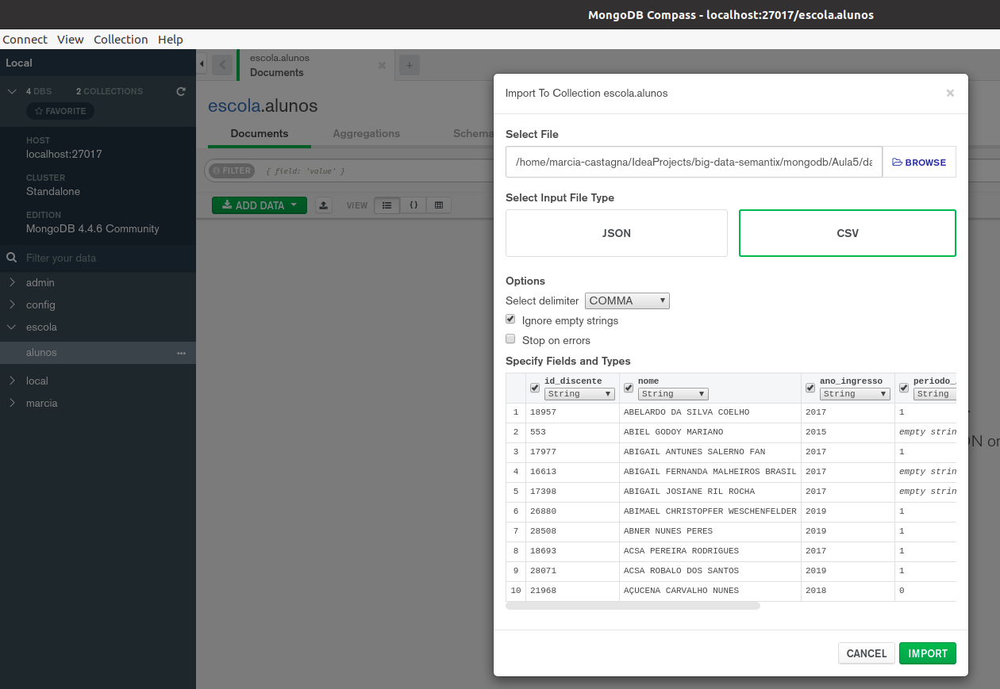
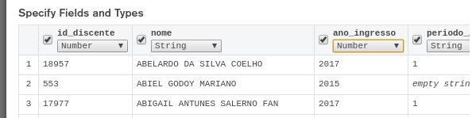
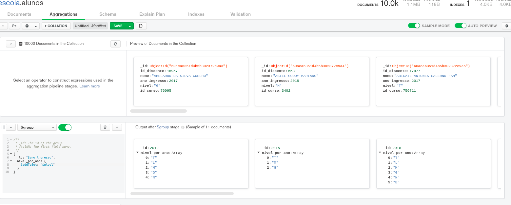
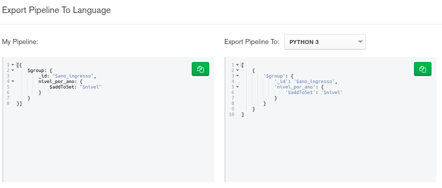
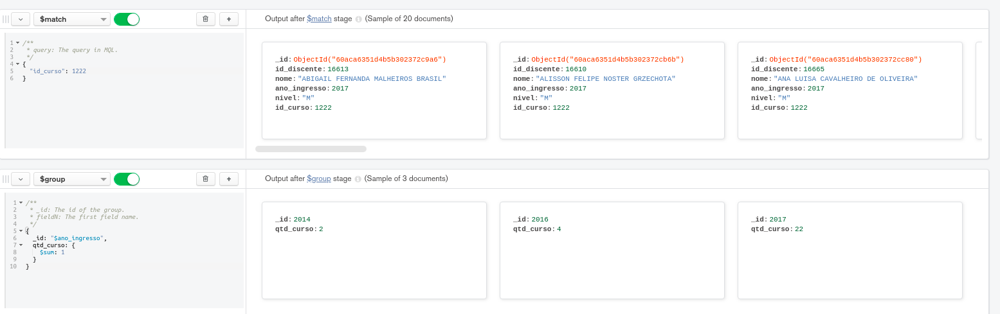

# Exercícios - Agregação I

Agregações de Match, Group, Sort e Limit

```

Subir container do mongo via docker

	$ docker-compose up -d

Baixar e instalar o 'MongoDB Compass' https://www.mongodb.com/try/download/compass

No 'MongoDB Compass', clicar em "Fill in connection fields individually"

Conectar ao servidor MongoDB:  localhost, 27017

```

```

1. Crie o banco de dados escola

Database Name: escola

2. Crie a collection alunos no banco de dados escola

Collection Name: alunos


// Ver print
3. Importe o arquivo “dataset/alunos.csv” para a collection alunos, com os seguintes atributos:

    // No MongoDB Compass manter marcado estes campos apenas, e selecionar os tipos conforme abaixo	
	// Ver print
	id_discente: Number
	nome: String
	ano_ingresso: Number
	nivel: String
	id_curso: Number

Arquivos para Dataset: pasta dataset, arquivos alunos.csv e cursos.csv

4. Visualizar os valores únicos do “nivel” de cada “ano_ingresso”

//addToSet valores únicos
// Ver print
[{
    $group: {
        _id: "$ano_ingresso",
        nivel_por_ano: {
            $addToSet: "$nivel"
        }
    }
}]


5. Calcular a quantidade de alunos matriculados por cada “id_curso”

[{
    $group: {
        _id: "$id_curso",
        qtd_curso: {
            $sum: 1
        }
    }
}]


// Ver print
6. Calcular a quantidade de alunos matriculados por “ano_ingresso” no "id_curso“: 1222

[{
    $match: {
        "id_curso": 1222
    }
}, {
    $group: {
        _id: "$ano_ingresso",
        qtd_curso: {
            $sum: 1
        }
    }
}]


7. Visualizar todos os documentos do “nível”: “M”

[{
    $match: {
        "nivel": "M"
    }
}]


8. Visualizar o último ano que teve cada curso (id_curso) dos níveis “M”

[{
    $match: {
        "nivel": "M"
    }
}, {
    $group: {
        _id: "$id_curso",
        "ultimo_ano_curso": {
            $max: "$ano_ingresso"
        }
    }
}]


9. Visualizar o último ano que teve cada curso (id_curso) dos níveis “M”, ordenados pelos anos mais novos de cada curso


// Cuidar para não confundir com o ano_ingresso, o sort deve ser pelo ultimo_ano_curso
[{
    $match: {
        "nivel": "M"
    }
}, {
    $group: {
        _id: "$id_curso",
        "ultimo_ano_curso": {
            $max: "$ano_ingresso"
        }
    }
}, {
    $sort: {
        "ultimo_ano_curso": -1
    }
}]


10. Visualizar o último ano que teve os 5 últimos cursos (id_curso) dos níveis “M”, ordenados pelos anos mais novos

[{
    $match: {
        "nivel": "M"
    }
}, {
    $group: {
        _id: "$id_curso",
        "ultimo_ano_curso": {
            $max: "$ano_ingresso"
        }
    }
}, {
    $sort: {
        "ultimo_ano_curso": -1
    }
}, {
    $limit: 5
}]


```

Exercício 3 (importando dados):



Exercício 3 (especificando campos):



Exercício 4:





Exercício 6:


