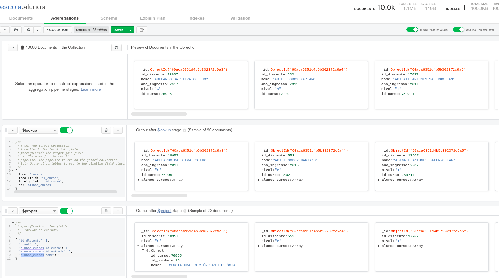

# Exercícios - Agregação II

Agregação com Lookup e project


```

1. Crie a collection cursos no banco de dados escola

2. Importe o arquivo “dataset\cursos.csv” para a collection cursos, com os seguintes atributos:

	id_curso: Number
	id_unidade: Number
	nome: String
	nivel: String


3. Realizar o left outer join da collection alunos e cursos, quando o id_curso dos 2 forem o mesmo.

/**
 * from: The target collection.
 * localField: The local join field.
 * foreignField: The target join field.
 * as: The name for the results.
 * pipeline: The pipeline to run on the joined collection.
 * let: Optional variables to use in the pipeline field stages.
 */

[{
    $lookup: {
        from: 'cursos',
        localField: 'id_curso',
        foreignField: 'id_curso',
        as: 'alunos_cursos'
    }
}]


4. Realizar o left outer join da collection alunos e cursos, quando o id_curso dos 2 forem o mesmo 
e visualizar apenas os seguintes campos

	Alunos: id_discente, nivel
	Cursos: id_curso, id_unidade, nome
	

[{
    $lookup: {
        from: 'cursos',
        localField: 'id_curso',
        foreignField: 'id_curso',
        as: 'alunos_cursos'
    }
}, {
    $project: {
        "id_discente": 1,
        "nivel": 1,
        "alunos_cursos.id_curso": 1,
        "alunos_cursos.id_unidade": 1,
        "alunos_cursos.nome": 1
    }
}]


```



